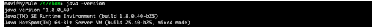
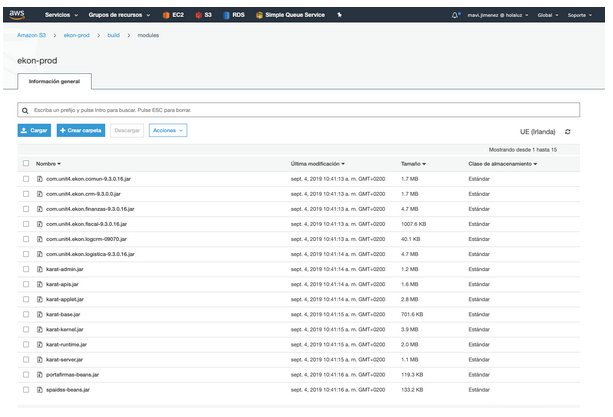
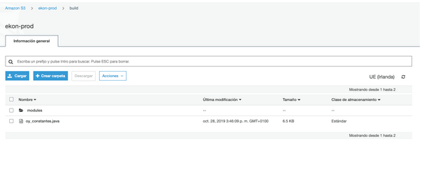
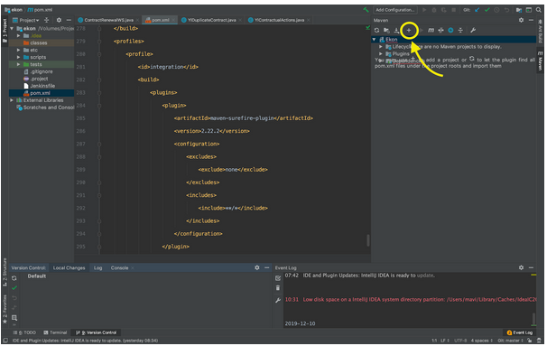
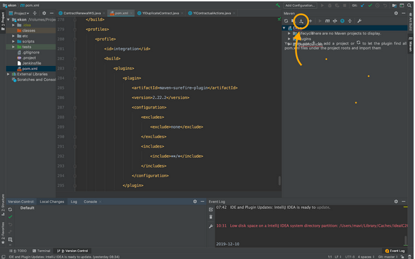
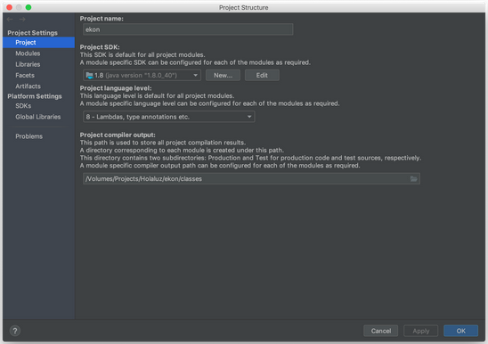
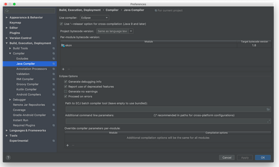
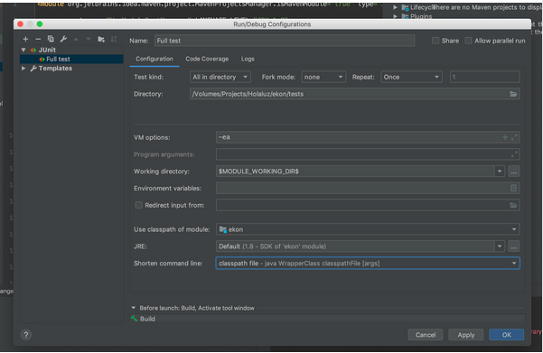
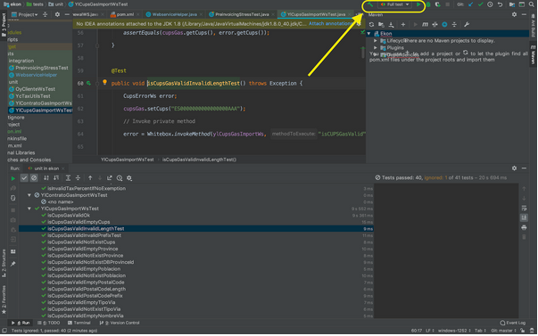
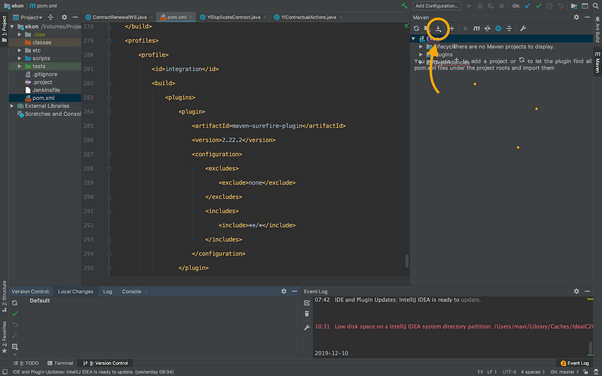

# Ejecutar los tests en ekon local
**1.** Por ahora trabajaremos en local, con lo cual tenemos que asegurarnos que tenemos en nuestra máquina la JDK 1.8. Asegurate de esto escribiendo **java -version** en tu terminal.

En caso de usar Ubuntu 18.04, también tendremos que asegurarnos que la versión de JavaFX es 1.8, ya que por defecto sólo instala la 11 y no hay paquetes a parte para la 8.
Para hacer downgrade (ATENCIÓN: esta versión no recibe actualizaciones de seguridad!):

`sudo apt install openjfx=8u161-b12-1ubuntu2 libopenjfx-java=8u161-b12-1ubuntu2 libopenjfx-jni=8u161-b12-1ubuntu2`

_Para alternar entre versiones de java:_
 `sudo update-alternatives --config java`
_Y seleccionar la deseada, en este caso la 8._

Es útil pinear estas versiones para que no se actualicen al hacer upgrade, creando el fichero /etc/apt/preferences.d/openjfx con el contenido:

Package: openjfx*

Pin: release a=bionic

Pin-Priority: 1001

Package: libopenjfx*

Pin: release a=bionic

Pin-Priority: 1001

**2.** Ahora tenemos que bajarnos el proyecto ekon en local [github.com](https://github.com/):

`git clone git@github.com:holaluz/ekon.git`

Esto nos bajará el proyecto en la carpeta ekon en el directorio en el que estemos en nuestra terminal.

**3.** Descargar del bucket de s3 el contenido de "ekon-prod/build/modules" (amb el seu contingut) y ponerlo en la raíz del proyecto (asegurarte que la carpeta modules esté en la raíz del proyecto)

**4.** Descarregar del bucket de s3 "ekon-prod/build" el fitxer **oy_constantes.java** posar-lo a dins de scripts/include de nuestro proyecto.

**5.** Abrimos IntelliJ y vamos al panel de Maven (el panel de la derecha), le damos al “+” y seleccionamos el fichero “pom.xml” que está en la raíz principal del proyecto.
Si no sale “Maven” a la derecha: haz botón derecho encima del archivo pom.xml y clicar en “Add as a Maven project”.

**6.** Apretar el botó de "Download source" per a descarregar totes les dependències.

    

**7.** Abrir File -> Project Structure.
* Definir "Project compiler output" al directori "classes" a dins del mateix projecte. Si la carpeta no existe, hay que crearla en la raíz del proyecto.
* Asegúrate de que todo queda como en la configuración de la imagen.

* Si no tienes el jdk que toca, prueba a descargarlo así: **sudo apt-get install openjdk-8-jdk**

**8.** Preferences -> Java Compiler. Asegúrate de que en el User compiler tienes “Eclipse”.

**9.** Run/Debug configurations:
* Presionamos “+”
* Add -> Junit
* Test kind -> All in directory.
* A "Directory" posar-hi el directori de "tests".
* Shorten Command line -> classpath file

**10.** Después de esto, damos a Apply y Ok y luego tenemos que dar a play de la esquina superior derecha. Magic! 🚀

## PROBLEMAS COMUNES :)
A veces el fichero DeployWS.java puede dar problemas de compilación en local. Una opción temporal es comentar toda la clase o borrarla y volver a intentarlo. Recuerda no comitear esto si haces cambios.

FALTAN DEPENDENCIAS: Si cambias de rama, a veces Maven no se descarga las dependencias del fichero pom.xml. 
Vuelve al botón Maven de la derecha y pulsa Download Sources y luego Reimport (botón más a la izquierda)

